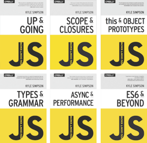
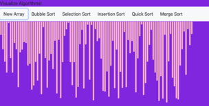
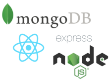

  
 👋🏾 Hi There! 👋🏾  

 
    💻 Learning Software Development! 💻.  

  
 Follow me on Github and check out my website to follow my journey! 

   

####                       [LinkedIn](https://www.linkedin.com/in/oriyomi-adeliyi/ "LinkedIn")
####                       [My Website](https://oriyomi.netlify.app "Website")

### 👓 My current projects/activities 👓

#### -  I'm reading the "You Don't Know JS Yet" series by Kyle Simpson to strengthen my JS skills. I'm on the "Scopes and Closures" book

#### - I'm working to improve my Sorting Visualizer

### 🌈  My future projects and goals 🌈

#### - I would like to add a blog to my portfolio website

#### -  I want to learn MERN stack through a course on Udemy

#### - I want to strengthen my Data Structures and Algorithms skills by continuing Data Structures and Alogorithms specialization on Coursera by UC San Diego

<!--
**oadeliyi1/oadeliyi1** is a ✨ _special_ ✨ repository because its `README.md` (this file) appears on your GitHub profile.

Here are some ideas to get you started:

- 🔭 I’m currently working on ...
- 🌱 I’m currently learning ...
- 👯 I’m looking to collaborate on ...
- 🤔 I’m looking for help with ...
- 💬 Ask me about ...
- 📫 How to reach me: ...
- 😄 Pronouns: ...
- ⚡ Fun fact: ...
-->
